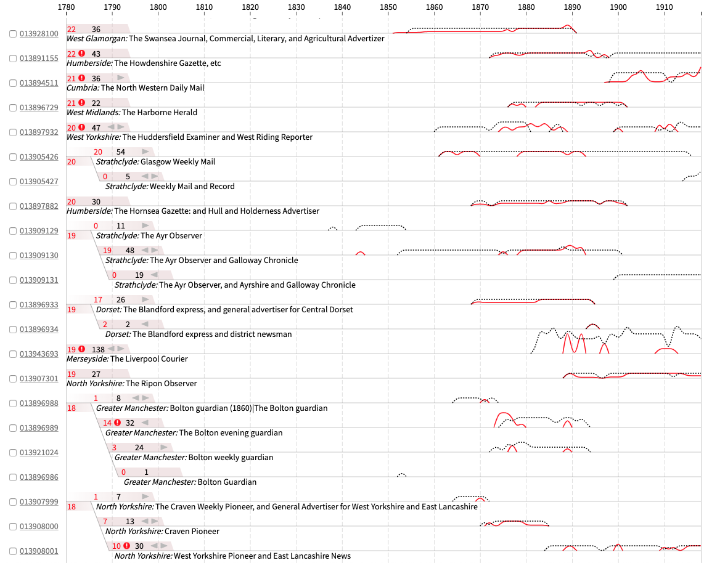
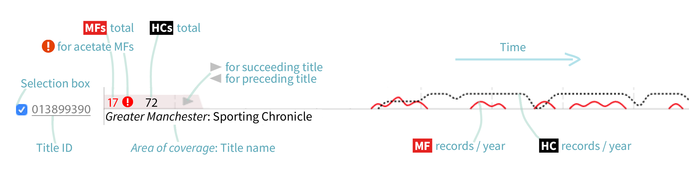
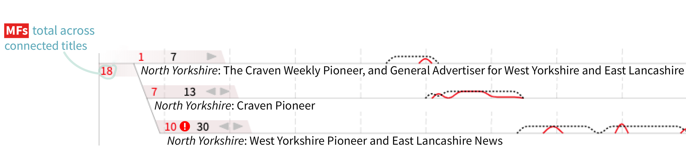

<div align="center">
    <br>
    <p align="center">
    <h1>Press Picker</h1>
    </p>
    <h2>An interactive visualisation tool for newspaper metadata</h2>
</div>

<p align="center">
    <a href="LICENSE">
        
    </a>
    <a href="https://mybinder.org/badge_logo.svg)](https://mybinder.org/v2/gh/Living-with-machines/PressPicker_public/HEAD">
        
    </a>
    <br/>
</p>

- [Introduction](#introduction)
- [How to read Press Picker](#how-to-read-press-picker)
- [Reuse the Press Picker code](#reuse-the-press-picker-code)
    - [Title-level data](#title-level-data)
    - [Microfilm and Hardcopy holdings: timeseries](#microfilm-and-hardcopy-holdings-timeseries)
- [Credits](#credits)

## Introduction

<p align="center">
    
</p>
         
Press Picker was created to help select British Library newspaper titles for digitisation. Read more about the context in [this blog post](https://livingwithmachines.ac.uk/press-picker-visualising-formats-and-title-name-changes-in-the-british-librarys-newspaper-holdings/). The tool provides an overview of newspaper holdings over time, their different formats (hardcopy or microfilm), and the relationship between titles connected by name changes. Titles can be selected within the interface and their data exported.  
 
 Press Picker consists of two Python [Jupyter notebooks](https://jupyter.org/). The first (Step 01) filters and processes the newspaper data in preparation for the second notebook (Step 02), which visualises the data. We also do some data pre-processing in another notebook `Preprocess_county_dataset.ipynb`. 
 
 (The visualisation code in Step 02 is written in JavaScript + [D3.js](https://d3js.org/). Using the Press Picker code does not require knowledge of JavaScript or D3.js, but for those interested in how to embed a D3 visualisation in a Python Jupyter notebook, we have written a [blogpost](https://livingwithmachines.ac.uk/d3-javascript-visualisation-in-a-python-jupyter-notebook/)). 
 
## How to read Press Picker

MF = microfilms
HC = hardcopies 

<p align="center">
    
    
</p>

The warning icon  appears for titles where some of the microfilms are acetate (a material used for some of the early British Library microfilms, but that degrades, so can’t be digitised off). 

## Reuse the Press Picker code

We are keen to develop the Press Picker code to be more reusable. If you have questions or need help, contact the developers (olivia.vane@bl.uk or khosseini@turing.ac.uk).

Because the processing in Step 01 is highly specific to British Library data, it may be more straightforward to focus on getting your data into the expected form for Step 02. Step 02 requires creating three datasets: `titles.json`, `timeseries_items_mf.json`, and `timeseries_items_hc.json` saved at the path `datasets/dynamic_io`. (If you are processing your data in Pandas, [df.to_json](https://pandas.pydata.org/pandas-docs/stable/reference/api/pandas.DataFrame.to_json.html) is helpful).

Have a look at the minimal demo we have created `minimal_demo/PressPicker_minimalDemo.ipynb` to better understand the expected contents and structure of these data.

### Title-level data

`titles.json`:
 
 Names changes through time are recorded in the facet "connectivity", which stores connected titles' Title.IDs. "connectivity" is not an obligatory facet though; it can be set to `null`. 
 
 For multiple connected titles, concatenate the multiple Title.ID strings (see the second example in `titles.json` below). The facets "Preceding titles" and "Succeeding titles" are used to power a tooltip in the visualisation. (The reasoning here is that "connectivity" was computationally generated, so having the original entries easily retrievable in the visualisation is valuable in the rare cases there are errors). 
 
 "connectivity", "Preceding titles", "Succeeding titles" can all be `null`.  
```
[
  {
    "Title.ID": "013898545",
    "Publication title": "Williamson's Liverpool Advertiser and Mercantile Chronicle",
    "General area of coverage": "Merseyside", 
    "Preceding titles": "Continues: Williamson's Liverpool Advertiser and Mercantile Register. vol.1.no.1-vol.4.no.171 (28 May 1756-31 Aug.1759)",
    "Succeeding titles": "Continued by: Billinge's Liverpool Advertiser and Marine Intelligencer. no.1955-2423, 3194-3769 (6 Jan.1794-27 Dec.1802; 5 Jan.1818-1824; 5 Jan.1826-30 Dec.1828)",
    "Explore link": "http://primocat.bl.uk/F?func=direct&local_base=ITEMV&doc_number=013898545&con_lng=eng",
    "connectivity": "013898546" 
  },
  {
    "Title.ID": "013892106",
    "Publication title": "Manchester Evening Chronicle",
    "General area of coverage": "Greater Manchester",
    "Preceding titles": null,
    "Succeeding titles": "Continued by: Evening Chronicle. no. 5240-20501 (1 April 1914-26 July 1963)",
    "Explore link": "http://primocat.bl.uk/F?func=direct&local_base=ITEMV&doc_number=013892106&con_lng=eng",
    "connectivity": "013894348,013892107"
  },
  { 
    "Title.ID": "013906312",
    "Publication title": "The Lancashire Leader",
    "General area of coverage": "Lancashire",
    "Preceding titles": null,
    "Succeeding titles": null,
    "Explore link": "http://primocat.bl.uk/F?func=direct&local_base=ITEMV&doc_number=013906312&con_lng=eng",
    "connectivity": null
  },
...]
  ```
  
### Microfilm and Hardcopy holdings: timeseries
These datasets are timeseries of the microfilm and hardcopy holdings per year for the "Title.ID"s in `titles.json`. In our data, the timeseries run from 1780-1918. Reusing the Press Picker code, create timeseries data for your years extent and the visualisation time axis will adapt to this.

In the following timeseries data, `"Total_canNos_below_4000"` is a British Library-specific piece of information about acetate microfilms. If this facet has a value > 0, it will show a warning icon  for the title. Hovering over the warning icon reveals a small message with the count value. Simply set this to "0.0" if it is not relevant to your data.   

`timeseries_items_mf.json`

```
{
  "010819462": {
    "1780": "0.0",
    "1781": "0.0",
    "1782": "0.0",
   ...
    "1916": "3.0",
    "1917": "3.0",
    "1918": "2.0",
    "Total_canNos_below_4000": "12.0"
  }, ... }
```
You'll notice in the timeseries data below there are non-integers. This is how we deal with items that cover more than one year: we split the item count across the years covered. In the example below, there was 1 hardcopy item covering  1843-1845, so 1843 ,1844, and 1845 each have the value 0.3333333333333333.  

`timeseries_items_hc.json`
```
{
  "013898541": {
    "1780": "0.0",
    "1781": "0.0",
    "1782": "0.0",
   ...
    "1843": "0.3333333333333333",
    "1844": "0.3333333333333333",
    "1845": "0.3333333333333333",
  ...
    "1916": "0.0",
    "1917": "0.0",
    "1918": "0.0",
    "Total_canNos_below_4000": "0.0"
  },
```

## Credits

Press Picker was developed by Olivia Vane, Kasra Hosseini and Giorgia Tolfo, as part of the [Living with Machines](https://livingwithmachines.ac.uk/) project.

Many thanks to Yann Ryan, the British Library Newspapers Collection curatorial team, Heritage Made Digital and the Imaging Studio for their help and guidance.

*Dataset credit*: ‘British and Irish Newspapers’, 2019, https://bl.iro.bl.uk/work/7da47fac-a759-49e2-a95a-26d49004eba8 , by British Library Contemporary British and British Library Collections Metadata. You can read more about the background to this list of newspaper titles in [this blog post](https://lukemckernan.com/2021/01/27/the-sorting-of-lists/) by Luke McKernan, Lead Curator News and Moving Image, British Library.
